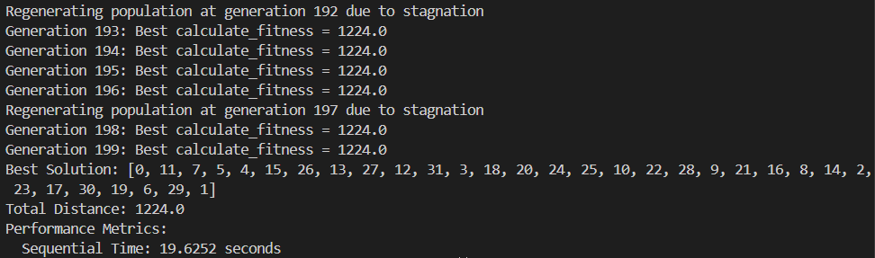
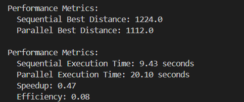
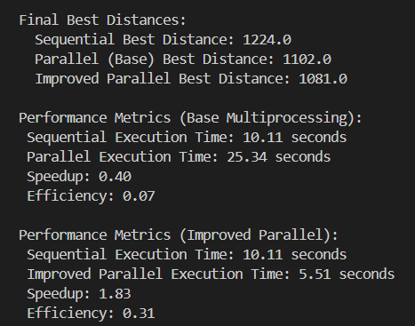

# DSAI 3202 – Parallel and Distributed Computing  

## Assignment 1 Part 2 - Navigating the City

### Objectives: Develop Python programs that run the uses genetic algorithms in a distributed fashion using MPI4PY or Celery

---

## Fleet management using genetic algorithms  

## Sequential Version

---
Q. Explain the program outlined in the script genetic_algorithm_trial.py.

**The main overview:**

- The script `genetic_algorithm_trial.py` implements a Genetic Algorithm (GA) to solve the Fleet Management Problem.
- The goal is to find the shortest possible route that visits all cities exactly once and returns to the starting city.
- The GA is a heuristic search algorithm inspired by natural selection, which evolves a population of solutions over generations.

**Key steps in the Algorithm:**

1. A unique population of routes is generated using the generate_unique_population function.
Each route starts and ends at the depot (node 0) and is a permutation of the remaining nodes.
2. The fitness of each route is calculated using the calculate_fitness function.

- The fitness is the total distance of the route (the goal is to minimize distance).
- A large negative penalty is returned if the route is infeasible (e.g., contains a distance of 10,000).

3. The select_in_tournament function implements tournament selection.

- It randomly selects a subset of individuals from the population and chooses the one with the best fitness to be a parent for the next generation.

4. The order_crossover function performs order crossover (OX) to create offspring.

- It combines parts of two-parent routes to produce a new route while preserving the order of cities.

5. The mutate function introduces random changes (swaps) in the route with a probability defined by the mutation rate.

- This helps maintain genetic diversity in the population.

6. If the algorithm does not improve the best fitness for a specified number of generations (stagnation_limit), the population is regenerated (except for the best individual) to avoid getting stuck in local optima.
7. The algorithm iterates over a fixed number of generations (num_generations).
In each generation, it evaluates the population's fitness, performs selection, crossover, and mutation, and updates the population.
8. After the loop completes, the best route found and its total distance are printed.

- The execution time is also recorded and returned.

Q. Run and time the execution of this script.

- 
- The execution time for the sequential version of the algorithm (as shown in the output) is 19.6252 seconds. This time may vary depending on the hardware and the size of the distance matrix.
- Stagnation Handling:
  - The algorithm frequently regenerates the population due to stagnation, indicating that it struggles to find better solutions after a few generations.
  - This suggests that the search space is complex, and the algorithm may benefit from additional optimization techniques.
- Fitness Improvement:
  - The best fitness improves over time, but the improvements are incremental:
    - Initially, the best fitness is 1395.0 (Generation 0).
    - After the first regeneration at Generation 5, the best fitness improves to 1278.0 (Generation 6).
    - Later, at Generation 92, the best fitness further improves to 1224.0, which remains the best solution until the end of the run.
  - The final best fitness is 1224.0, which corresponds to a total distance of 1224 units.
- Scalability:
  - The algorithm is computationally expensive due to the large population size (10,000) and the number of generations (200).
  - Parallelization could significantly reduce the execution time.

---

## Parallel Version (Using Multiprocessing)

6. Parallelize the code (20 pts)
After running the code sequentially, the current part of the assignment requires you to run the code in parallel using multiprocessing.

- Define the parts to be parallelized, explain your choices

1. **Fitness Calculation**: Each individual's fitness is computed independently, making it ideal for parallel processing.
2. **Selection**: Tournament selection can be performed concurrently across different subsets of the population.
3. **Crossover & Mutation**: These genetic operations are applied to selected parents independently, allowing for parallel execution.
4. **Re-evaluation**: After generating new offspring, their fitness evaluations can be parallelized.

- Parallelize your program using multiprocessing.
We employed Python’s `concurrent.futures.ProcessPoolExecutor` to distribute tasks across multiple processes. The key steps include:
- **Chunking the Population**: The population is divided into smaller chunks, each processed by a separate worker.
- **Worker Function**: Each worker computes fitness, performs selection, crossover, and mutation on its assigned chunk.
- **Parallel Execution**: The main process submits tasks to the executor, which distributes them among the available worker processes.

- **Below is a critical section of the parallel implementation:**

```python
 # Step 2: Start parallel pool
    with ProcessPoolExecutor(max_workers=num_procs) as executor:
        for gen in range(1, generations + 1):

            # Handle stagnation: Regenerate population if no improvement
            if stagnation_counter >= stagnation_limit:
                print(f"Regenerating population at generation {gen} due to stagnation")
                population = np.array(
                    generate_unique_population(population_size - 1, distance_matrix.shape[0]) + [best_solution]
                )
                stagnation_counter = 0

            # Safety check: ensure correct population size
            if population.shape[0] != population_size:
                population = np.array(
                    generate_unique_population(population_size - 1, distance_matrix.shape[0]) + [best_solution]
                )

            # Step 3: Split population into chunks for parallel workers
            chunks = np.array_split(population, num_procs)
            chunks = [chunk.tolist() for chunk in chunks]  # Convert to lists for multiprocessing

            # Step 4: Submit parallel tasks (each worker handles fitness + selection + crossover + mutation)
            futures = [
                executor.submit(worker_process, chunk, distance_matrix, mutation_rate, num_tournaments)
                for chunk in chunks
            ]
            results = [f.result() for f in futures]  # Wait for all workers to finish

            # Step 5: Collect offspring and fitness values from all workers
            offspring_chunks, fitness_chunks = zip(*results)
            population = np.array(list(chain.from_iterable(offspring_chunks)))  # Flatten offspring
```

- `from itertools import chain flattens the list of lists efficiently, it’s used to:`
  - Merge the offspring returned from multiple worker processes
  - Merge their fitness scores into one array
  - This ensures the next generation operates on a clean, unified population.
  - Added due to the scalar array and index out of bound errors.

- **ProcessPoolExecutor:** Manages a pool of worker processes to which tasks can be submitted. It handles the distribution of tasks and collection of results.
- **Chunking the Population:** The population is split into smaller subsets (chunks), each assigned to a different worker process. This division enables parallel processing of these subsets, improving efficiency.
- **Submitting Tasks:** For each chunk, a task is submitted to the executor. The worker_process function is called with the chunk and other necessary parameters. Each worker operates independently, performing fitness evaluation, selection, crossover, and mutation on its assigned chunk.
- **Collecting Results:** Once all tasks are completed, the main process collects the results (new offspring and their fitness values) from all workers and combines them to form the updated population.

- Run your code and compute the performance metrics.
  - 
  - **Solution Quality:** The parallel implementation discovered a better solution (distance of 1112.0) compared to the sequential version (distance of 1224.0). This improvement is likely due to increased exploration facilitated by parallel processing.
  - **Execution Time:** Despite parallelization, the execution time increased. This outcome can be attributed to:
    - Inter-process Communication Overhead: Transferring data between processes incurs additional time.
    - Memory Transfer Costs: Large data structures, such as the distance matrix and population, require significant resources to share among processes.
    - Process Management Overhead: Initiating and managing multiple processes introduces additional computational overhead.

7. Enhance the algorithm (20 pts).
There are several improvements that can be implemented in the algorithm.

- What improvements do you propose? Add them to your code.

  - Elitism: Retains best individuals across generations.
  - Adaptive mutation rate: Mutation decreases as generations progress.
  - Early stopping: Stops if a satisfactory solution is found.
  - Convergence detection: Stops if no significant improvement in recent generations.
  - Vectorized fitness: Uses fast NumPy operations to compute distances.

| Problem in Base Version                          | Solution in Improved Version                                                                                   |
|--------------------------------------------------|---------------------------------------------------------------------------------------------------------------|
| High overhead in fitness calculation             | Used `vectorized_fitness()` to minimize per-individual computation                                         |
| Fixed mutation rate led to early stagnation      | Introduced `adaptive mutation rate` to maintain diversity early and reduce noise later                     |
| No protection for best solutions                 | Implemented `elitism` to ensure best individuals are preserved across generations                          |
| Only stagnation used for early exit              | Added `early convergence detection` (based on no improvement over X generations) + early stopping threshold |
| Execution time was long despite parallelism      | Reduced overhead by combining operations in `worker_process()` and avoiding large shared memory transfers   |

- After adding your improvements, recompute the performance metrics and compare with before the enhancements.

  - 
  - The base multiprocessing version produced better routes than the sequential version but suffered from overhead and communication latency.
  - The improved version achieved the best of both worlds:
    - Higher-quality solutions (lowest route distance)
    - Faster execution (more than 2x faster than base parallel)
  - These improvements make the algorithm scalable, robust, and efficient for larger problem sizes.

---

## Parallel Version (Using Distributed mpi4py)

6. Parallelize the code
After running the code sequentially and with multiprocessing, the current part of the assignment requires you to run the code in parallel over multiple machines.

- Define the parts to be distributed and parallelized, explain your choices
- Parallelize your program
- Run your code and compute the performance metrics

7. Enhance the algorithm
There are several improvements that can be implemented in the algorithm.

- Distribute your algorithm over 2 machines or more
- What improvements do you propose? Add them to your code
- After adding your improvements, recompute the performance metrics and compare with before the enhancements

---
