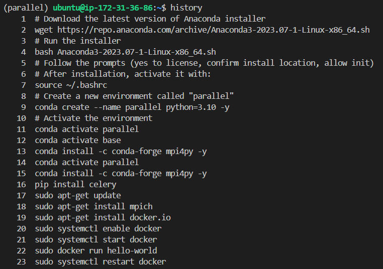

# AWS Virtual Machine Lab Setup
---
## Overview
This lab involves setting up a Virtual Machine (VM) on a cloud service, configuring it, and installing necessary tools like Anaconda, mpi4py, Celery, and Docker. The setup is done using the xlarge template for the VM, and SSH access will be configured using a newly created key pair.
---
### Requirements
- Cloud VM Setup:
- Create a Virtual Machine (VM) with the Large template.
- Choose the large template for your machine.
- Ensure that you create a new key pair for SSH access.
---
### SSH Access:
- After creating the key pair, download the .pem key file.
- Copy this .pem file to your local .ssh folder for easy access.
---
### VM Access:
- Connect to the VM using an SSH client or a terminal in VS Code.
- Follow the necessary steps to configure the environment, ensuring you can connect to the VM successfully.
---
### Software Installation:
- Download Anaconda on the VM.
- Create a new environment in Anaconda.
- Install mpi4py, Celery, and Docker in the created environment.
---
### The following commands were used to accomplish the above asked tasks, after connecting to the AWS VM:
