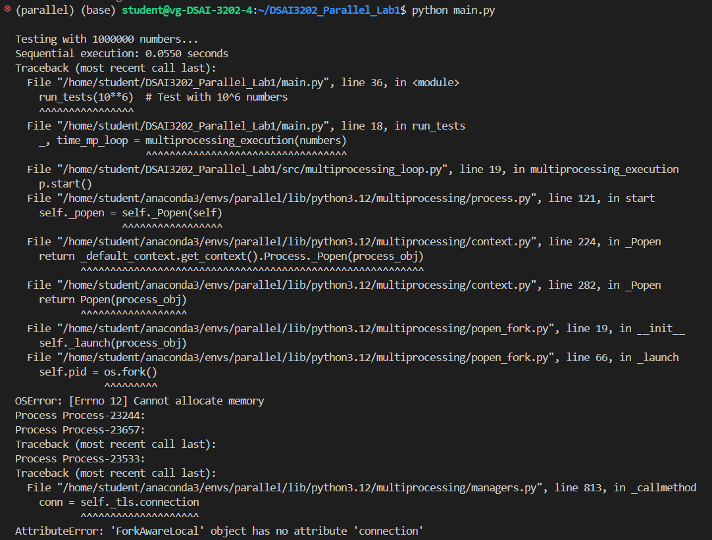
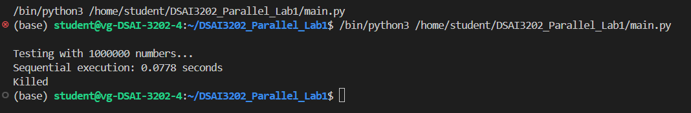

# DSAI 3202 – Parallel and Distributed Computing  
## Assignment 1 Part 1 - Multiprocessing 
### Objectives: Develop python programs that take advantage of python multiprocessing capabilities.
---
### Square Program
- Create a function square that computes the square number of an int.
- Create a list of 10^6 numbers.
- Time the program in these scenarios on the random list.
    - A sequential for loop.
    - A multiprocessing for loop with a process for each number.
    - A multiprocessing pool with both map() and apply().
    - A concurrent.futures ProcessPoolExecutor.
- What are your conclusions?
    - The multiprocessing loop creating a process for each number crashes the first time with a memory error and gets killed the next execution if we try to run the program again.
    - 
    - 
    - Therefore, we cannot create a process for each number because it leads to excessive memory allocation and process overhead, making it impractical, so we remove the execution of multiprocessing_loop.py from main.py
- Redo the test with 10^7 numbers. 
- Test both synchronous and asynchronous versions in the pool. 
- What are your conclusions?

