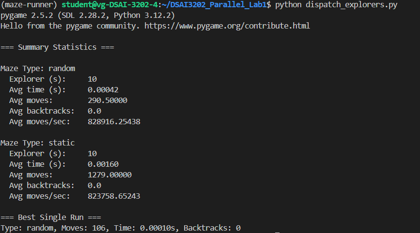
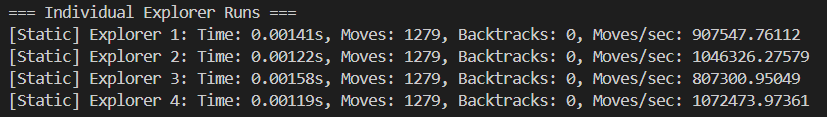

# DSAI3202 - Parallel and Distributed Computing

---

# Assignment 2 - Maze Explorer Game

A simple maze exploration game built with Pygame where you can either manually navigate through a maze or watch an automated solver find its way to the exit.

---

### Question 1 (10 points)

Explain how the automated maze explorer works. Your answer should include:

1. The algorithm used by the explorer
2. How it handles getting stuck in loops
3. The backtracking strategy it employs
4. The statistics it provides at the end of exploration

To answer this question:

1. Run the explorer both with and without visualization
2. Observe its behavior in different maze types
3. Analyze the statistics it provides
4. Read the source code in `explorer.py` to understand the implementation details

Your answer should demonstrate a clear understanding of:

- The right-hand rule algorithm
- The loop detection mechanism
- The backtracking strategy
- The performance metrics collected

### Answer 1 (10 points)

The explorer implements the right‑hand rule (also called wall‑following). At each step it:

- Turns right and checks if it can move forward.
- If blocked, goes straight.
- If still blocked, turns left.
- As a last resort, turns around (180°) and moves.

By always “keeping its right hand on the wall,” it will eventually traverse every corridor in a simply‑connected maze and reach the exit.

In the code, explorer.py, the `solve()` method implements the right‑hand rule by repeatedly calling `turn_right()`, testing `can_move_forward()`, then falling back to straight, left, or a 180° turn if necessary.
To detect loops it keeps the last three positions in `self.move_history` and `is_stuck()` returns true when they’re identical.
In that case it calls `backtrack()`, which builds a short path back to the last junction (using `find_backtrack_path()` and `count_available_choices()`), pops positions off `self.backtrack_path`, and moves there before resuming the wall‑following logic. Throughout, it records every move in `self.moves`, timestamps `self.start_time/self.end_time`, and increments `self.backtrack_count`.
At the end it calls `print_statistics()`, which reports total time, total moves, number of backtracks, and average moves per second.
If visualize=True, each move also triggers `draw_state()`, which renders the maze and explorer via Pygame (and in the Jupyter demo via visualize_maze or JupyterExplorer), whereas with visualize=False it runs headless and simply returns the raw metrics.

In `maze_visualization.py`, the demo shows performance analysis of the automated explorer on different maze types with and without visulization, without visulization it returns the raw metrics therefore the `total_time_taken` is `0.0 seconds` and with visulization it returns `total_time_taken` greater than 0.0 seconds due to the rendering overhead.
The performance metrics collected and displayed after an explorer has solved one maze are:

1. Total time taken: Shows how long the explorer takes to solve the maze, wall-clock duration from start_time = time.time to end_time = time.time.
2. Total moves made: The length of self.moves—i.e. every single step the explorer actually took in the maze. This tells you how long the path was.
3. Number of backtrack operations: The value of self.backtrack_count, incremented each time backtrack() successfully moves the explorer back to a junction. A high count indicates many dead‑ends or loops were encountered.
4. Average moves per second: Computed as len(self.moves) / time_taken. This combines path length and speed into one efficiency metric: higher means the solver covered more ground faster (or did less rendering).

Together, these four give you a complete picture of how long the solver ran, how far it traveled, how often sit got stuck and had to reverse, and how efficiently it moved through the maze.

---

### Question 2 (30 points)

Modify the main program to run multiple maze explorers simultaneously. This is because we want to find the best route out of the maze. Your solution should:

1. Allow running multiple explorers in parallel
2. Collect and compare statistics from all explorers
3. Display a summary of results showing which explorer performed best

*Hints*:

- To get 20 points, use use multiprocessing.
- To get 30 points, use MPI4Py on multiple machines.
- Use Celery and RabbitMQ to distribute the exploration tasks. You will get full marks plus a bonus.
- Implement a task queue system
- Do not visualize the exploration, just run it in parallel
- Store results for comparison

**To answer this question:**

1. Study the current explorer implementation
2. Design a parallel execution system
3. Implement task distribution
4. Create a results comparison system

### Answer 2 (30 points)

To support parallel maze exploration, the original single-explorer program was extended to launch and manage multiple maze explorers concurrently. This was achieved using Celery, a distributed task queue framework, along with RabbitMQ as the message broker and Redis as the results backend.

1. The parallel execution system is implemented using Celery tasks (explore_task) in explorer_tasks.py.

2. Each task creates a maze, runs the explorer without visualization (visualize=False), and returns performance statistics.

3. The file dispatch_explorers.py schedules N=10 explorers per maze type (e.g., random, static) to run asynchronously using explore_task.delay(), enabling true concurrent execution across CPU cores or distributed machines.

4. Celery uses RabbitMQ to queue tasks and distribute them to available worker processes.

5. Each worker handles one maze exploration, allowing horizontal scalability.

6. Redis is used as a result backend to store and retrieve exploration results reliably.

7. Once all tasks are complete, the dispatch_explorers.py script performs the following:

- Collects all results using result.get() which blocks until each task finishes.
- Groups results by maze type (e.g., random, static) using a defaultdict.
- Computes average statistics for each group:
  - Average time taken
  - Average number of moves
  - Average number of backtracks
  - Average moves per second
- Identifies the best single run (i.e., explorer with the lowest number of moves).
- Prints a summary report, helping determine which maze type and explorer performed best.
- 

**To run the parallel program `dispatch_explorers.py` follow the instructions:**

1. Run RabbitMQ on PC cmd using the command `ssh -L 15672:localhost:15672 user@ip_address`
2. Run `celery -A explorer_tasks worker --loglevel=info` in VS code terminal
3. In Another VS code terminal run `python dispatch_explorers.py`

---

### Question 3 (10 points)

Analyze and compare the performance of different maze explorers on the static maze. Your analysis should:

1. Run multiple explorers (at least 4 ) simultaneously on the static maze
2. Collect and compare the following metrics for each explorer:
   - Total time taken to solve the maze
   - Number of moves made
   - *Optional*:
     - Number of backtrack operations

3. What do you notice regarding the performance of the explorers? Explain the results and the observations you made.

### Answer 3 (10 points)

In order to analyze and compare the performance of 4 maze explorers simultaneously on the static maze of (30:30), I changed the dispatch_explorers to:

```
1. Set number of explorers per maze type
    N = 4
    maze_types = ['static']
```

To collect and compare the metrics for each explorer, lets adds to the dispatch_explorers.py program to provide metrcis for all runs in addition to the average summary statistics.

- 


The metrics for each explorer shows: 

1. **Consistency in moves** - All explorers completed the maze with the same number of moves (1279), indicating they likely followed the same path-finding algorithm and encountered the same maze layout. However, the same number of moves taken by each explorer indicate no improvement, suggesting that **the right-hand rule does not guarantee the shortest path**.
2. **Highlighting the ineffeciency** - 1279 moves in a 30x30 maze (which has only 900 cells) implies a non-optimal path — this is of concern.
3. **No Backtracks** - None of the explorers needed to backtrack. While this might seem efficient, it also implies the algorithm might avoid re-evaluating paths that could be shorter — again pointing to the right-hand rule's limitations.
4. **Time Taken** - The time taken per explorer ranged between 0.00119s and 0.00158s. This variance is negligible and likely due to OS-level scheduling rather than any meaningful performance difference.
4. **Moves per second** - Ranged from ~807,000 to ~1,072,000. Although this sounds impressive, the high number of moves needed shows that speed is masking inefficiency. In other words, the explorers are fast — but not smart.
**Explorer 4 achieved the highest throughput - taking the least amount of times with the same number of moves as all other explorers.**

This analysis reveals that the explorers' strategy — a deterministic wall-following rule called the right-hand rule — leads to consistent but suboptimal performance. While all explorers reached the goal, they took significantly more steps than necessary, suggesting a lack of path optimization.

---

### Question 4 (20 points)

Based on your analysis from Question 3, propose and implement enhancements to the maze explorer to overcome its limitations. Your solution should:

1. Identify and explain the main limitations of the current explorer:
* 1. Non-optimal path: The right‑hand rule “hugs” one wall and often winds through loops and long corridors, resulting in ~1279 steps in a 30×30 maze—far above the true minimum (~128).
  2. No global awareness: It only considers its immediate neighbors and doesn’t remember which direction actually leads closer to the goal, so it revisits cells unnecessarily.
  3. Ineffecient on Perfect maze: Perfect (loop‑free) mazes are trees—wall‑following must traverse every branch before finding the exit, exploring O(n) cells in the worst case.
  4. Unbounded backtracking: When stuck, it backtracks to the last junction—but that can still retrace large portions of the maze repeatedly.

2. Propose specific improvements to the exploration algorithm:
To guarantee shortest paths and avoid redundant exploration, we introduce two classic graph‑search methods:

* 1. Breadth-First Search (BFS):
- Guarantees the absolute shortest path (in number of steps) on an unweighted grid.
- Explores layer by layer, never revisiting a cell.
- 
* 2. A* Search with Manhattan Heuristic:
- Uses a heuristic (Manhattan distance) to guide the search toward the goal.
- Still optimal if the heuristic is admissible, but explores far fewer nodes than plain BFS on large grids. 

3. Implement at least two of the proposed improvements:
- Implemented in the src folder, BFS search in `explorer_bfs.py` and A* search with manhattan distance in `explorer_aStar.py`.

### Key differences vs. the original right‑hand rule:

- Global vs. local: BFS/A* maintain a full visited set to never re‑enter a cell, whereas the right‑hand rule only looks back three steps for loops.

- Guaranteed optimality: BFS finds the shortest path by layers; A* uses a heuristic to focus the search, both delivering the true minimum step count (≈109) instead of ~1279.

- No ad‑hoc backtracking: Both algorithms expand new nodes in a systematic order and never “jump back” manually—they simply never revisit a node once it’s closed.

---

### Question 5 (20 points)

Compare the performance of your enhanced explorer with the original:

- Run both versions on the static maze
- Collect and compare all relevant metrics
- Create visualizations showing the improvements
- Document the trade-offs of your enhancements
Your answer should include:

1. Performance comparison results and analysis
2. Discussion of any trade-offs or new limitations introduced

---

### Final points 6 (10 points)

1. Solve the static maze in 150 moves or less to get 10 points.
2. Solve the static maze in 135 moves or less to get 15 points.
3. Solve the static maze in 130 moves or less to get 100% in your assignment.
