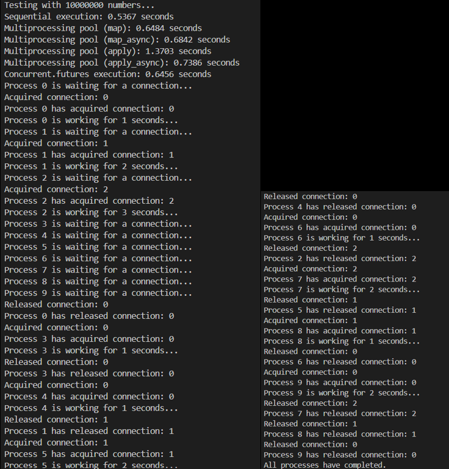

# DSAI 3202 – Parallel and Distributed Computing  
## Assignment 1 Part 1 - Multiprocessing 
### Objectives: Develop Python programs that take advantage of Python's multiprocessing capabilities.
---

## Square Program
- Create a function `square` that computes the square of an integer.
- Create a list of 106 numbers.
- Time the program in these scenarios on the random list:
    - A sequential for loop.
    - A multiprocessing for loop with a process for each number.
    - A multiprocessing pool with both `map()` and `apply()`.
    - A `concurrent.futures` `ProcessPoolExecutor`.
- What are your conclusions?
    - The multiprocessing loop program creating a process for each number crashes the first time with a memory error and gets killed upon subsequent executions if we try to run the program again.
    - 
    - 
    - Therefore, we cannot create a process for each number because it leads to excessive memory allocation and process overhead, making it impractical. Consequently, we remove the execution of `multiprocessing_loop.py` from `main.py`.
- Redo the test with 107 numbers.
- Test both synchronous and asynchronous versions in the pool.
- What are your conclusions?
    - 
    - From the results, we can see that:
        - **Sequential execution** is the most efficient for small inputs and simple programs like squaring 106 and 107 numbers.
        - **Multiprocessing Pool Synchronous version** using `map()` is more efficient compared to `apply()` since `apply()` creates a new process per call, which introduces significant overhead and slows down the execution.
        - **Multiprocessing Pool Asynchronous version** using `map_async()` performs slightly worse than `map()` since it introduces some overhead associated with managing asynchronous calls.
        - **Multiprocessing Pool Asynchronous version** using `apply_async()` performs better than `apply()` because it allows for non-blocking execution (meaning it does not prevent the execution of a task while waiting for a result), enabling other tasks to proceed while waiting for the result, thus improving overall efficiency.
        - **Multiprocessing Pooling using both synchronous and asynchronous methods** shows that `apply_async()` is more efficient in scenarios where non-blocking behavior is beneficial, as it reduces idle time and makes better use of system resources.
        - **Multiprocessing execution using `concurrent.futures.ProcessPoolExecutor`** is the most efficient among the tested methods. This is because `ProcessPoolExecutor` provides a high-level interface for asynchronously executing callables, managing a pool of processes, and efficiently distributing tasks among them, leading to improved performance.
        - **On a side note, chunking improved both pooling and process pool executor performance in terms of time** since it reduces the frequency of communicaton between processes by grouping tasks together, leading to fewer process management operation for pooling and it allows for better scheduling of tasks across worker, especially in asynchronous execution reducing the overall overhead calls for managing individual tasks for process pool executor.

---

## Process Synchronization with Semaphores
### Overview
In order to experiment on how to use semaphores in Python’s multiprocessing 
module to manage access to a limited pool of resources. Implement a ConnectionPool class that simulates a pool of database connections, using a semaphore to control access. 
- Create a ConnectionPool class with methods to get and release connections, 
using a semaphore to limit access. 
- Write a function that simulates a process performing a database operation by 
acquiring and releasing a connection from the pool. 
- Observe how the semaphore ensures that only a limited number of processes 
can access the pool at any given time.
### Instructions
----
1. Create the ConnectionPool Class
2. Implement the Database Operation Function
3. Set Up Multiprocessing

- We have a connection pool (collection of database connections) with 3 connections (e.g., [0, 1, 2]).
- We have 10 processes [0-9] that all need to use a connection from the pool.
- We have the semaphore initialized with a count of 3, meaning only 3 processes can acquire a connection at a time.
----
4. Discuss Observations
- What happens if more processes try to access the pool than there are available 
connections? 
    - The order of execution would be:
    1. The order in which processes acquire and release connections is non-deterministic (unpredictable) because it depends on how the operating system schedules the processes.
    2. Processes 0, 1, and 2 acquire the 3 available connections. The semaphore count drops to 0, meaning no more connections are available.
    3. Processes 3-9 try to acquire a connection but find that the semaphore count is 0. These processes wait (block) until a connection becomes available.
    4. When a process finishes its work (e.g., after sleeping to simulate work), it releases the connection back to the pool. The semaphore count is incremented, and one of the waiting processes can now acquire the released connection.
    - This happens because semaphore ensures that only the allowed number of processes (equal to the pool size) can access the pool at any time preventing resource exhaustion. 
- How does the semaphore prevent race conditions and ensure safe access to the connections?
    - A race condition occurs when multiple processes try to access a shared resource in our case the connection pool, 10 processes trying to access 3 connection pools would cause resource exhaustion and the connection pool would become inconsistent and corrupted.
    - The semaphore acts as a counter that tracks the number of available connections.
    - Its atomic operations (acquire() and release()) ensure that only upto 3 processes can acquire or release a connection at a time.
        - When a process acquires a connection, the semaphore count is decremented.
        - When a process releases a connection, the semaphore count is incremented.
        - This ensures that no more than 3 processes can access the connection pool simultaneously.
    - This prevents race conditions and ensures that the connection pool is accessed safely.
---